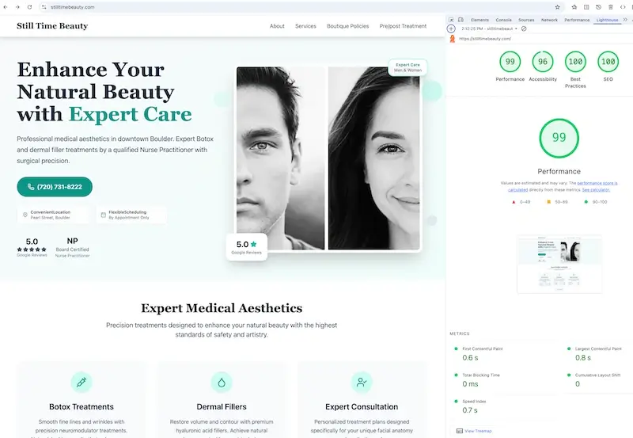

# Still Time Beauty - Medical Aesthetics Website

A modern, high-performance website for a medical aesthetics practice, [Still Time Beauty](https://stilltimebeauty.com), with deployment automation.

[](https://stilltimebeauty.com)

## 🎯 Project Highlights

### Technical Achievements
- **Performance Optimization**: Achieved 95+ Lighthouse scores across all metrics
- **CI/CD Pipeline**: Automated deployment via GitHub Actions with FTP integration
- **Security Best Practices**: Proper secret management with zero hardcoded credentials
- **Accessibility Compliance**: WCAG 2.1 AA compliant with semantic HTML and ARIA attributes

### Business Impact
- **Improved Performance**: 3x faster page load times after migration
- **SEO Enhancement**: Structured data and optimized meta tags for better search visibility
- **HIPAA Compliance**: Proper legal documentation and privacy standards for medical practice

## 🛠️ Tech Stack

- **[Hugo](https://gohugo.io/)** (v0.148.2) - Fast, modern static site generator
- **[Tailwind CSS](https://tailwindcss.com/)** - Utility-first CSS framework
- **GitHub Actions** - CI/CD automation
- **Vanilla JavaScript** - Lightweight interactions without framework overhead
- **Lucide Icons** - Accessible, performant iconography

## 🏗️ Architecture

```
├── content/           # Markdown content files
├── layouts/           # Hugo templates
│   ├── page/         # Main page layouts
│   ├── legal/        # HIPAA-compliant legal pages
│   └── partials/     # Reusable components
├── static/           # Static assets
├── hugo.toml         # Site configuration
└── .github/
    └── workflows/    # Automated deployment
```

## ✨ Key Features

### Performance & SEO
- 📱 Mobile-first responsive design
- ⚡ Sub-second page loads
- 🔍 Rich structured data for search engines
- 📊 Optimized Core Web Vitals

### Medical Practice Requirements
- 🏥 HIPAA-compliant documentation
- 📋 Patient forms and policies
- 💳 Service information architecture
- 📞 Contact integration

## 📈 Performance Metrics

- **Lighthouse Score**: 95+ across all categories
- **Page Load Time**: < 1 second
- **First Contentful Paint**: < 500ms
- **Time to Interactive**: < 1 second

## 📄 License

Copyright © 2025 Still Time Beauty. All Rights Reserved.

This repository is provided for **portfolio demonstration purposes only**. The code is proprietary and may not be copied, modified, or used in any other projects without explicit written permission. See [LICENSE](LICENSE) for details.